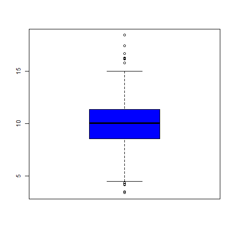
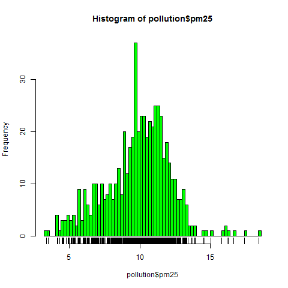
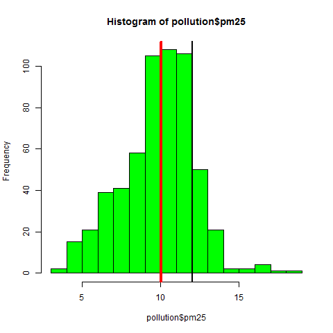
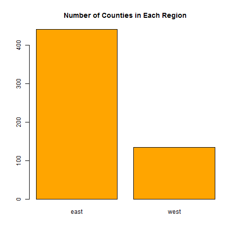
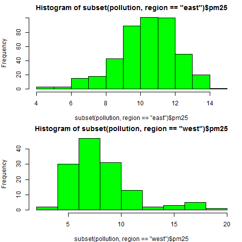
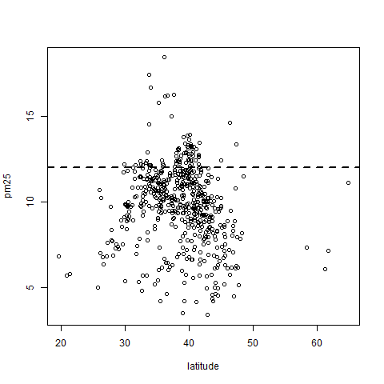
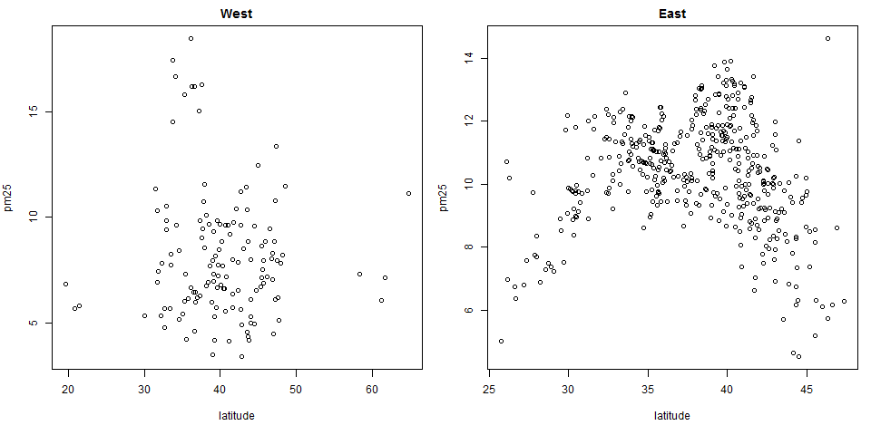

Week 1-2
========

## Exploratory Graphs
Roger D. Peng, 
Associate Professor of Biostatistics
Johns Hopkins Bloomberg School of Public Health

### Why do we use graphs in data analysis?
- To understand data properties
- To find patterns in data
- To suggest modeling strategies
- To "debug" analyses

### Characteristics of exploratory graphs
- They are made quickly
- A large number are made
- The goal is for personal understanding
- Axes/legends are generally cleaned up (later)
- Color/size are primarily used for information

### Air Pollution in the United States
- The U.S. Environmental Protection Agency (EPA) sets national ambient air quality standards for outdoor air pollution
  - [U.S. National Ambient Air Quality Standards]
- For fine particle pollution (PM2.5), the "annual mean, averaged over 3 years" cannot exceed 12 μg/m^3.
- Data on daily PM2.5 are available from the U.S. EPA web site
  - [EPA Air Quality System]
- **Question**: Are there any counties in the U.S. that exceed that national standard for fine particle pollution?

### Data
Annual average PM2.5 averaged over the period 2008 through 2010
```r
pollution <- read.csv("data/avgpm25.csv", colClasses = c("numeric", "character", 
    "factor", "numeric", "numeric"))
head(pollution)
##     pm25  fips region longitude latitude
## 1  9.771 01003   east    -87.75    30.59
## 2  9.994 01027   east    -85.84    33.27
## 3 10.689 01033   east    -87.73    34.73
## 4 11.337 01049   east    -85.80    34.46
## 5 12.120 01055   east    -86.03    34.02
## 6 10.828 01069   east    -85.35    31.19
```
Do any counties exceed the standard of 12 μg/m^3?

### Simple Summaries of Data
One dimension
 - Five-number summary
 - Boxplots
 - Histograms
 - Density plot
 - Barplot

### Five Number Summary
```r
summary(pollution$pm25)
##    Min. 1st Qu.  Median    Mean 3rd Qu.    Max. 
##    3.38    8.55   10.00    9.84   11.40   18.40
```

### Boxplot
```r
boxplot(pollution$pm25, col = "blue")
```



### Hisogram

```r
hist(pollution$pm25, col = "green")
```


```r
hist(pollution$pm25, col = "green")
rug(pollution$pm25)
```


```r
hist(pollution$pm25, col = "green", breaks = 100)
rug(pollution$pm25)
```



### Overlaying Features

```r 
boxplot(pollution$pm25, col = "blue")
abline(h = 12)
```


```r
hist(pollution$pm25, col = "green")
abline(v = 12, lwd = 2)
abline(v = median(pollution$pm25), col = "magenta", lwd = 4)
```



### Barplot

```r
barplot(table(pollution$region), col = "orange", main = "Number of Counties in Each Region")
```



### Simple Summaries of Data
Two dimensions
 - Multiple/overlayed 1-D plots (Lattice/ggplot2)
 - Scatterplots
 - Smooth scatterplots

\> 2 dimensions
- Overlayed/multiple 2-D plots; coplots
- Use color, size, shape to add dimensions
- Spinning plots
- Actual 3-D plots (not that useful)

### Multiple Boxplots
```r
boxplot(pm25 ~ region, data = pollution, col = "red")
```


### Multiple Histograms
```r
par(mfrow = c(2, 1), mar = c(4, 4, 2, 1))
hist(subset(pollution, region == "east")$pm25, col = "green")
hist(subset(pollution, region == "west")$pm25, col = "green")
```



### Scatterplot
```r
with(pollution, plot(latitude, pm25))
abline(h = 12, lwd = 2, lty = 2)
```



Using color
```r
with(pollution, plot(latitude, pm25, col = region))
abline(h = 12, lwd = 2, lty = 2)
```


### Multiple Scatterplots

```r
par(mfrow = c(1, 2), mar = c(5, 4, 2, 1))
with(subset(pollution, region == "west"), plot(latitude, pm25, main = "West"))
with(subset(pollution, region == "east"), plot(latitude, pm25, main = "East"))
```



### Summary
- Exploratory plots are "quick and dirty"
- Let you summarize the data (usually graphically) and highlight any broad features
- Explore basic questions and hypotheses (and perhaps rule them out)
- Suggest modeling strategies for the "next step"

### Further resources
- [R Graph Gallery]
- [R Bloggers]

[U.S. National Ambient Air Quality Standards]:http://www.epa.gov/air/criteria.html
[EPA Air Quality System]:http://www.epa.gov/ttn/airs/airsaqs/detaildata/downloadaqsdata.htm
[R Graph Gallery]:http://archive.today/gallery.r-enthusiasts.com
[R Bloggers]:http://www.r-bloggers.com/
