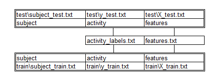

## CodeBook

### Data Info

Human Activity Recognition Using Smartphones Data Set
http://archive.ics.uci.edu/ml/datasets/Human+Activity+Recognition+Using+Smartphones

The experiments have been carried out with a group of 30 volunteers within an age bracket of 19-48 years. Each person performed six activities (WALKING, WALKING_UPSTAIRS, WALKING_DOWNSTAIRS, SITTING, STANDING, LAYING) wearing a smartphone (Samsung Galaxy S II) on the waist. Using its embedded accelerometer and gyroscope, we captured 3-axial linear acceleration and 3-axial angular velocity at a constant rate of 50Hz. The experiments have been video-recorded to label the data manually. The obtained dataset has been randomly partitioned into two sets, where 70% of the volunteers was selected for generating the training data and 30% the test data. 

The sensor signals (accelerometer and gyroscope) were pre-processed by applying noise filters and then sampled in fixed-width sliding windows of 2.56 sec and 50% overlap (128 readings/window). The sensor acceleration signal, which has gravitational and body motion components, was separated using a Butterworth low-pass filter into body acceleration and gravity. The gravitational force is assumed to have only low frequency components, therefore a filter with 0.3 Hz cutoff frequency was used. From each window, a vector of features was obtained by calculating variables from the time and frequency domain. See 'Features Info' for more details. 

### What was done?
What was done with the raw data? The data was composed in the following way(schematically shown on the schema). Extracted only the measurements on the mean and standard deviation for each measurement. 

 

### Features Info

- *subject* - Volounteer Id
 
- *activity* - Type of performed activity

The features selected for this database come from the accelerometer and gyroscope 3-axial raw signals. These time domain signals

> **t** - denotes time

were captured at a constant rate of 50 Hz. Then they were filtered using a median filter and a 3rd order low pass Butterworth filter with a corner frequency of 20 Hz to remove noise. Similarly, 
the acceleration signal was then separated into body and gravity acceleration signals using low pass Butterworth filter with a corner frequency of 0.3 Hz.

> **Body** - for body signals

> **Gravity** - for gravity signals

- *tBody._*
- *tGravity._*

The features selected for this database come from the: 
> **Acceleration** - accelerometer 

> **Gyroscope** - gyroscope

- *tBody.Acceleration*
- *tGravity.Acceleration*
- *tBody.Gyroscope*

Subsequently, the body linear acceleration and angular velocity were derived in time to obtain Jerk signals:
> **Jerk** - to denote Jerk signal

- *tBody.Acceleration.Jerk*
- *tBody.Gyroscope.Jerk*

The magnitude of these three-dimensional signals were calculated using the Euclidean norm: 
> **Magnitude** - to denote magnitude

- *tBody.Acceleration.Magnitude*
- *tGravity.Acceleration.Magnitude* 
- *tBody.Acceleration.Jerk.Magnitude*
- *tBody.Gyroscope.Magnitude* 
- *tBody.Gyroscope.Jerk.Magnitude*
 

Finally a Fast Fourier Transform (FFT) was applied to some of these signals producing:
> **f** - to indicate frequency domain signals

- *fBody.Acceleration*
- *fBody.Acceleration.Jerk*
- *fBody.Gyroscope*
- *fBody.Acceleration.Magnitude*

- *fBody.Body.Acceleration.Jerk.Magnitude*
- *fBody.Body.Gyroscope.Magnitude*
- *fBody.Body.Gyroscope.Jerk.Magnitude*

The set of variables that were estimated from these signals are: 
> **.mean** - Mean value

> **.std** - Standart deviation

> **.meanFreq** - Weighted average of the frequency components

These signals were used to estimate variables of the feature vector for each pattern:  
> **.XYZ** - to denote 3-axial signals

Additional vectors obtained by averaging the signals in a signal window sample. These are used on the variable:

> **angle( )**

- *angle(tBody.AccelerationMean,gravity)*
- *angle(tBody.Acceleration.JerkMean),gravityMean)*
- *angle(tBody.GyroscopeMean,gravityMean)*
- *angle(tBody.Gyroscope.JerkMean,gravityMean)*
- *angle(XYZ,gravityMean)*