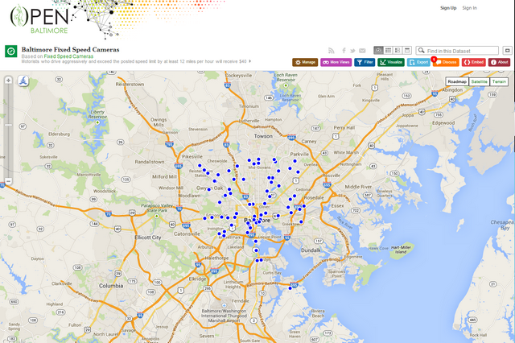

Week 1-2
========

## Downloading files and reading local flat files
Jeffrey Leek,
Assistant Professor of Biostatistics
Johns Hopkins Bloomberg School of Public Health

### Get/set your working directory
- A basic component of working with data is knowing your working directory
- The two main commands are `getwd()` and `setwd()`.
- Be aware of relative versus absolute paths
  - Relative - `setwd("./data")`, `setwd("../")`
  - Absolute - `setwd("/Users/jtleek/data/")`
- Important difference in Windows `setwd("C:\\Users\\Andrew\\Downloads")`

### Checking for and creating directories
- `file.exists("directoryName")` will check to see if the directory exists
- `dir.create("directoryName")` will create a directory if it doesn't exist
- Here is an example checking for a "data" directory and creating it if it doesn't exist
```r
if (!file.exists("data")) {
    dir.create("data")
}
```

### Getting data from the internet - `download.file()`
- Downloads a file from the internet
- Even if you could do this by hand, helps with reproducibility
- Important parameters are `url`, `destfile`, `method`
- Useful for downloading tab-delimited, csv, and other files

### Example - Baltimore camera data



https://data.baltimorecity.gov/Transportation/Baltimore-Fixed-Speed-Cameras/dz54-2aru

Click button 'Export' or

```r
fileUrl <- "https://data.baltimorecity.gov/api/views/dz54-2aru/rows.csv?accessType=DOWNLOAD"
download.file(fileUrl, destfile = "./data/cameras.csv", method = "curl")
list.files("./data")
## [1] "cameras.csv"
dateDownloaded <- date()
dateDownloaded
## [1] "Sun Jan 12 21:37:44 2014"
```
### Some notes about `download.file()`
- If the url starts with *http* you can use `download.file()`
- If the url starts with *https* on Windows you may be ok
- If the url starts with *https* on Mac you may need to set `method="curl"`
- If the file is big, this might take a while
- Be sure to record when you downloaded.

### Download file to load
```r
if (!file.exists("data")) {
    dir.create("data")
}
fileUrl <- "https://data.baltimorecity.gov/api/views/dz54-2aru/rows.csv?accessType=DOWNLOAD"
download.file(fileUrl, destfile = "cameras.csv", method = "curl")
dateDownloaded <- date()
```

### Loading flat files - read.table()
- This is the main function for reading data into R
- Flexible and robust but requires more parameters
- Reads the data into RAM - big data can cause problems
- Important parameters `file`, `header`, `sep`, `row.names`, `nrows`
- Related: `read.csv()`, `read.csv2()`

### Baltimore example
```r
cameraData <- read.table("./data/cameras.csv")
## Error: line 1 did not have 13 elements
head(cameraData)
## Error: object 'cameraData' not found
```

```r
cameraData <- read.table("./data/cameras.csv", sep = ",", header = TRUE)
head(cameraData)
##                          address direction      street  crossStreet
## 1       S CATON AVE & BENSON AVE       N/B   Caton Ave   Benson Ave
## 2       S CATON AVE & BENSON AVE       S/B   Caton Ave   Benson Ave
## 3 WILKENS AVE & PINE HEIGHTS AVE       E/B Wilkens Ave Pine Heights
## 4        THE ALAMEDA & E 33RD ST       S/B The Alameda      33rd St
## 5        E 33RD ST & THE ALAMEDA       E/B      E 33rd  The Alameda
## 6        ERDMAN AVE & N MACON ST       E/B      Erdman     Macon St
##                 intersection                      Location.1
## 1     Caton Ave & Benson Ave (39.2693779962, -76.6688185297)
## 2     Caton Ave & Benson Ave (39.2693157898, -76.6689698176)
## 3 Wilkens Ave & Pine Heights  (39.2720252302, -76.676960806)
## 4     The Alameda  & 33rd St (39.3285013141, -76.5953545714)
## 5      E 33rd  & The Alameda (39.3283410623, -76.5953594625)
## 6         Erdman  & Macon St (39.3068045671, -76.5593167803)
```

`read.csv(x)` same as `read.table(x, sep=",", header=TRUE)`

```r
cameraData <- read.csv("./data/cameras.csv")
head(cameraData)
```

### Some more important parameters
- `quote` - you can tell R whether there are any quoted values quote="" means no quotes.
- `na.strings` - set the character that represents a missing value.
- `nrows` - how many rows to read of the file (e.g. nrows=10 reads 10 lines).
- `skip` - number of lines to skip before starting to read


