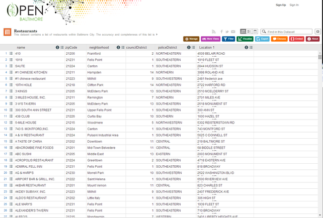

Week 3-2
========

## Summarizing data set
Jeffrey Leek,
Assistant Professor of Biostatistics
Johns Hopkins Bloomberg School of Public Health

### Example data set


https://data.baltimorecity.gov/Community/Restaurants/k5ry-ef3g

### Getting the data from the web
```r
if(!file.exists("./data")){
    dir.create("./data")
}
fileUrl <- "https://data.baltimorecity.gov/api/views/k5ry-ef3g/rows.csv?accessType=DOWNLOAD"
download.file(fileUrl,destfile="./data/restaurants.csv",method="curl")
restData <- read.csv("./data/restaurants.csv")
```

### Look at a bit of the data
```r
head(restData,n=3)
##    name zipCode neighborhood councilDistrict policeDistrict
## 1   410   21206    Frankford               2   NORTHEASTERN 
## 2  1919   21231  Fells Point               1   SOUTHEASTERN
## 3 SAUTE   21224       Canton               1   SOUTHEASTERN
##                        Location.1
## 4509 BELAIR ROAD\nBaltimore, MD\n
##    1919 FLEET ST\nBaltimore, MD\n
##   2844 HUDSON ST\nBaltimore, MD\n
tail(restData,n=3)
##                  name zipCode  neighborhood councilDistrict policeDistrict
## 1325 ZINK'S CAF\u0090   21213 Belair-Edison              13   NORTHEASTERN
## 1326     ZISSIMOS BAR   21211       Hampden               7       NORTHERN
## 1327           ZORBAS   21224     Greektown               2   SOUTHEASTERN
##                              Location.1
## 1325 3300 LAWNVIEW AVE\nBaltimore, MD\n
## 1326      1023 36TH ST\nBaltimore, MD\n
## 1327  4710 EASTERN Ave\nBaltimore, MD\n
```
### Make summary
```r
summary(restData)
##                           name         zipCode             neighborhood councilDistrict
## MCDONALD'S                  :   8   Min.   :-21226   Downtown    :128   Min.   : 1.00  
## POPEYES FAMOUS FRIED CHICKEN:   7   1st Qu.: 21202   Fells Point : 91   1st Qu.: 2.00  
## SUBWAY                      :   6   Median : 21218   Inner Harbor: 89   Median : 9.00  
## KENTUCKY FRIED CHICKEN      :   5   Mean   : 21185   Canton      : 81   Mean   : 7.19  
## BURGER KING                 :   4   3rd Qu.: 21226   Federal Hill: 42   3rd Qu.:11.00  
## DUNKIN DONUTS               :   4   Max.   : 21287   Mount Vernon: 33   Max.   :14.00  
## (Other)                     :1293                    (Other)     :863                  
##      policeDistrict                        Location.1      
## SOUTHEASTERN:385    1101 RUSSELL ST\nBaltimore, MD\n:   9  
## CENTRAL     :288    201 PRATT ST\nBaltimore, MD\n   :   8  
## SOUTHERN    :213    2400 BOSTON ST\nBaltimore, MD\n :   8  
## NORTHERN    :157    300 LIGHT ST\nBaltimore, MD\n   :   5  
## NORTHEASTERN: 72    300 CHARLES ST\nBaltimore, MD\n :   4  
## EASTERN     : 67    301 LIGHT ST\nBaltimore, MD\n   :   4  
## (Other)     :145    (Other)                         :1289 
```
### More in depth information
```r
str(restData)
## 'data.frame':   1327 obs. of  6 variables:
##  $ name           : Factor w/ 1277 levels "#1 CHINESE KITCHEN",..: 9 3 992 1 2 4 5 6 7 8 ...
##  $ zipCode        : int  21206 21231 21224 21211 21223 21218 21205 21211 21205 21231 ...
##  $ neighborhood   : Factor w/ 173 levels "Abell","Arlington",..: 53 52 18 66 104 33 98 133 ...
##  $ councilDistrict: int  2 1 1 14 9 14 13 7 13 1 ...
##  $ policeDistrict : Factor w/ 9 levels "CENTRAL","EASTERN",..: 3 6 6 4 8 3 6 4 6 6 ...
##  $ Location.1     : Factor w/ 1210 levels "1 BIDDLE ST\nBaltimore, MD\n",..: 835 334 554 ...
```

### Quantiles of quantitative variables
```r
quantile(restData$councilDistrict,na.rm=TRUE)
##   0%  25%  50%  75% 100% 
##    1    2    9   11   14 
quantile(restData$councilDistrict,probs=c(0.5,0.75,0.9))
## 50% 75% 90% 
##   9  11  12 
```

### Make table
```r
table(restData$zipCode,useNA="ifany")
table(restData$councilDistrict,restData$zipCode)
```

### Check for missing values
```r
sum(is.na(restData$councilDistrict))
## [1] 0
any(is.na(restData$councilDistrict))
## [1] FALSE
all(restData$zipCode > 0)
## [1] FALSE
```

### Row and column sums
colSums(is.na(restData))
```r
## name  zipCode    neighborhood councilDistrict  policeDistrict      Location.1 
##    0        0               0               0               0               0 
all(colSums(is.na(restData))==0)
## [1] TRUE
```

### Values with specific characteristics
```r
table(restData$zipCode %in% c("21212"))
## FALSE  TRUE 
##  1299    28 
table(restData$zipCode %in% c("21212","21213"))
## FALSE  TRUE 
##  1268    59
restData[restData$zipCode %in% c("21212","21213"),]
##                            name zipCode                neighborhood councilDistrict
## 29            BAY ATLANTIC CLUB   21212                    Downtown              11
## 39                  BERMUDA BAR   21213               Broadway East              12
## 92                    ATWATER'S   21212   Chinquapin Park-Belvedere               4
## 111  BALTIMORE ESTONIAN SOCIETY   21213          South Clifton Park              12
## 187                    CAFE ZEN   21212                    Rosebank               4
## 220 ...
```