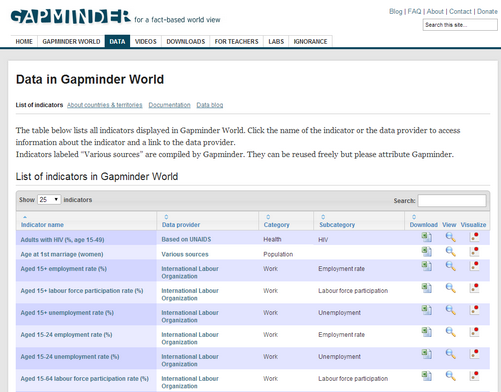
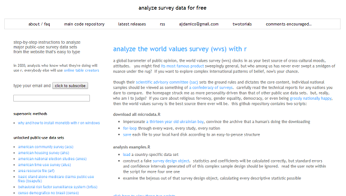
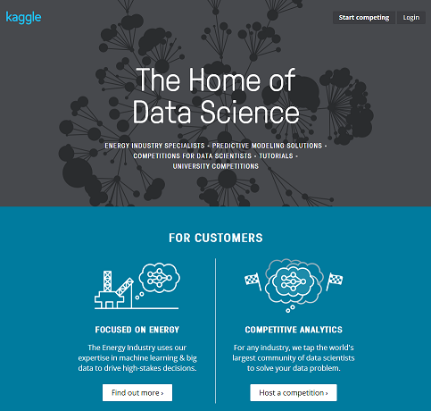

Week 4-4
========

## Data resourses
Jeffrey Leek,
Assistant Professor of Biostatistics
Johns Hopkins Bloomberg School of Public Health

### Open Government Sites
- United Nations
  - http://data.un.org/
- U.S. 
  - http://www.data.gov/
  - [List of cities/states with open data](http://simplystatistics.org/2012/01/02/list-of-cities-states-with-open-data-help-me-find/)
- United Kingdom 
  - http://data.gov.uk/
- France 
  - http://www.data.gouv.fr/
- Ghana 
  - http://data.gov.gh/
- Australia 
  - http://data.gov.au/
- Germany 
  - https://www.govdata.de/
- Hong Kong 
  - http://www.gov.hk/en/theme/psi/datasets/
- Japan 
  - http://www.data.go.jp/
- Many more ...
  - http://www.data.gov/opendatasites

### More specialized collections
- [Stanford Large Newtork Data](http://snap.stanford.edu/data/)
- [UCI Machine Learning](http://archive.ics.uci.edu/ml/)
- [KDD Nugets Datasets](http://www.kdnuggets.com/datasets/index.html)
- [CMU Statlib](http://lib.stat.cmu.edu/datasets/)
- [Gene expression omnibus](http://www.ncbi.nlm.nih.gov/geo/)
- [ArXiv Data](http://arxiv.org/help/bulk_data)
- [Public Data Sets on Amazon Web Services](http://aws.amazon.com/public-data-sets/)

### Gapminder

http://www.gapminder.org/

### Survey data from the United States

http://www.asdfree.com/

### Infochimps Marketplace

http://www.infochimps.com/

### Kaggle

http://www.kaggle.com/

### Collections by data scientists
- Hilary Mason
  - http://bitly.com/bundles/hmason/1
- Peter Skomoroch 
  - https://delicious.com/pskomoroch/dataset
- Jeff Hammerbacher 
  - http://www.quora.com/Jeff-Hammerbacher/Introduction-to-Data-Science-Data-Sets
- Gregory Piatetsky-Shapiro 
  - http://www.kdnuggets.com/gps.html
- http://blog.mortardata.com/post/67652898761/6-dataset-lists-curated-by-data-scientists

