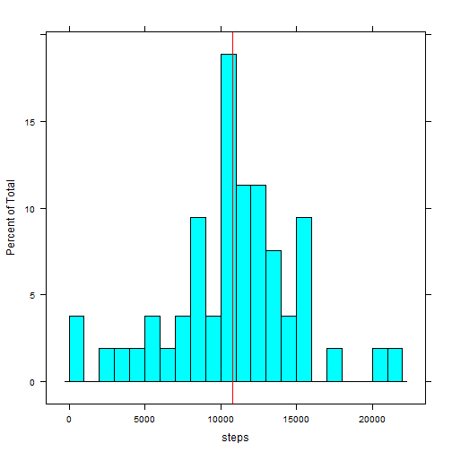
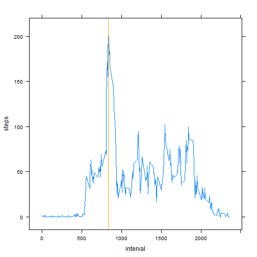
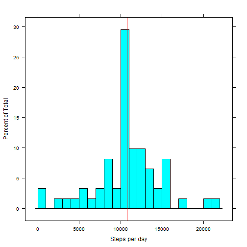

```r
echo = TRUE          ## Always print the code
options(scipen = 1)  ## Turn-off scientific notation
```

## Loading and preprocessing the data

```r
unzip("activity.zip")
RAW <- read.csv("activity.csv")
```

## What is mean total number of steps taken per day?

```r
library(lattice)
data <- RAW[!is.na(RAW$steps),]
data <- aggregate(steps ~ date, data = data, FUN = sum)
medianSteps <- median(data$steps)  ## Median of steps
meanSteps <- mean(data$steps)      ## Mean of steps
histogram(~ steps, data = data, breaks = 25
          , panel = function(...) {              
              panel.histogram(...)
              panel.abline(v = median(data$steps), col = "red")
          })
```

 

**median** of total number of steps taken per day: 10765

**mean** of total number of steps taken per day: 10766.1887

## What is the average daily activity pattern?

```r
data <- RAW[!is.na(RAW$steps),1:3]
data <- aggregate(steps ~ interval, data = data, FUN = mean)

maxSteps <- max(data$steps)
maxInterval <- data[data$steps == maxSteps,]$interval

xyplot(steps ~ interval, data = data, type = "l"
       , panel = function(x,y,...){
           panel.xyplot(x,y,...)
           panel.abline(v = maxInterval, col = "orange")
       })
```

 

5-minute interval which contains the maximum average number of steps: 835

Number of steps at this time: 206.1698

## Imputing missing values

```r
## Using data from previous question. Na values will be replaced
## with 'averege per interval' values.
names(data)[2] <- "meanSteps" 
data <- merge(RAW, data)
missing <- is.na(data$steps)
naRowsCount <- length(missing[missing == TRUE])  ## Number of missing values
data[missing,]$steps <- data[missing,]$meanSteps ## replacing missing values

dataSum <- aggregate(steps ~ date, data = data, FUN = sum)

medianStepsFull <- median(dataSum$steps)
meanStepsFull <- mean(dataSum$steps)

histogram(~ steps, data = dataSum, xlab = "Steps per day", breaks = 25
          , panel = function(...){
              panel.histogram(...)
              panel.abline(v = median(dataSum$steps), col = "red")
          })
```

 

Total number of missing values: 2304

NA values were replaced with 'averege per interval' values.
New values of **mean** and **median** of total number of steps taken per day:

**mean**: 10766.1887 (was 10766.1887)

**median**: 10766.1887 (was 10765)

Median is slightly differ from median with omitted NA.

## Are there differences in activity patterns between weekdays and weekends?
Yes, there are lot of differences between *weekend* and *weekday* activity patterns. It's obvious, for example, that on the weekend one sleeps longer.


```r
data$weekend <- as.POSIXlt(data$date)$wday %in% c(0,6)
data <- transform(data, weekend = factor(weekend, labels = c("Weekday", "Weekend")))
data <- aggregate(steps ~ interval + weekend, data = data, FUN = mean)
xyplot(steps ~ interval | weekend, data = data, type = "l", layout = c(1,2))
```

 
